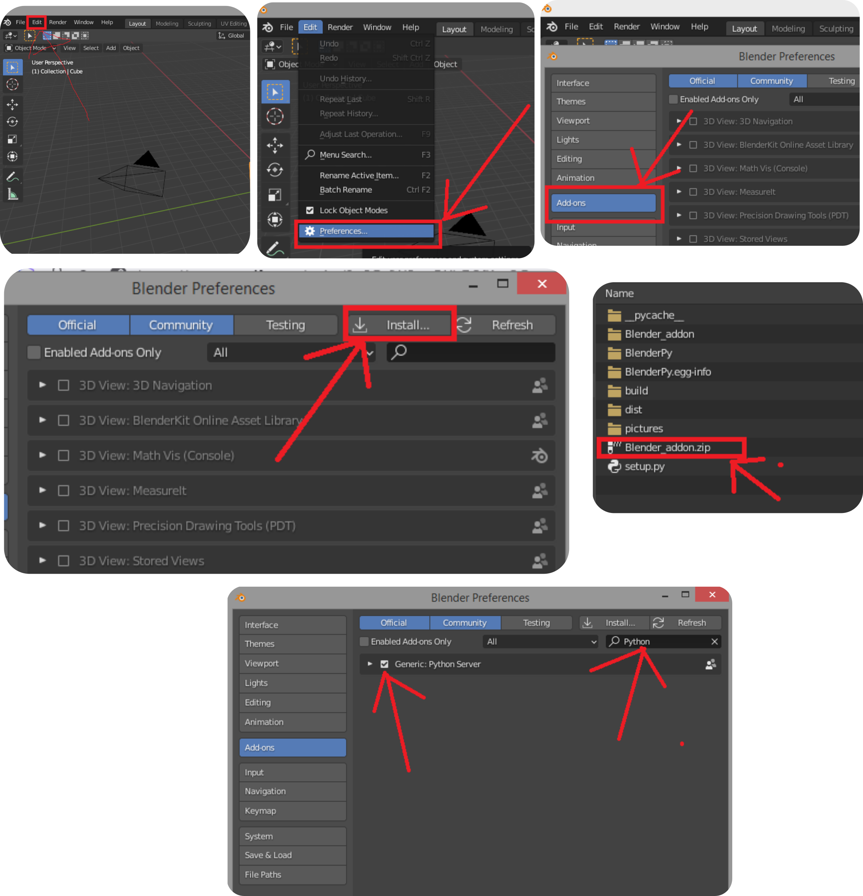
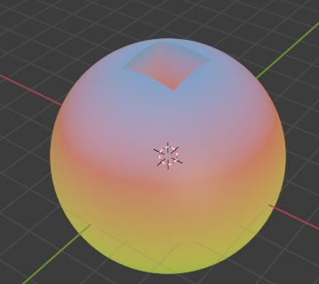

# BlenderPy

BlenderPy is a high level python API wrapped around the Blender python API, but which can be used from a python interpreter thanks to a server
running on a Blender add-on.

## Installation

The installation is done in two parts:

* The python installation

You should download the repository by typing `git clone https://github.com/ThibaultCapelle/BlenderPy.git`
in the parent repository where you want it to be installed.
This last command requires to have git installed, if not you can have it [here](https://git-scm.com/downloads , "Git").
After that, you navigate to the repository in a shell and use the command `pip install -r requirements.txt`

* The Blender addon installation

Open Blender, and go to Edit/Preferences/Add-ons/Install, and then navigate to the repository, and select Blender_addon.zip.
Then find the installed add-on, called "Python Server" by searching "Python" with "Community" activated. Then, tick the box to activate it.

Now the add-on is up and running, and you won't need to reactivate it every time you launch Blender. You can see some debugging text in the Blender
console, that you can see by clicking on "Window/Toggle System Console".

## Basic use

To use it, you will need to have Blender open, and to execute some Python commands from a Python interpreter.
The high level classes and methods are in three submodules:

### BlenderPy.sending_data 

This submodule contains the delete_all() method, and the Material, Scene, Camera, Light, Curve classes, as well as all the object methods, 
constraints, etc.

### BlenderPy.meshing

This submodule contains all the meshing tools, basic shapes you want to use: Box, Sphere, Plane, Cylinder, Arrow, Path, Rectangle, RoundCorner, 
AngularSector, Circle

### BlenderPy.external_loading

This submodule contains the classes used to load external files. The three format currently supported are:
* VTU files: those are for example the results of a Comsol simulation
* STL files: those are for example a Comsol geometry, or an Inventor/SolidWorks/Catia export
* GDS files

### Examples

#### Playing around with a ball, a cube and materials



```
from BlenderPy.sending_data import delete_all, Material
from BlenderPy.meshing import Box, Sphere

delete_all()
s=Sphere(radius=3, refine=5)
b=Box(Lx=1.5, Ly=1.5, Lz=1.5)
b.zmax=s.zmax
s.subtract(b)
b.remove()
glow_material=Material()
glow_material.glowing(color='#1BE636', strength=0.1)
glow_material.z_dependant_color(positions=[0.,0.75,1.],
                               colors=['#5DF604', 
                                       '#DF1111',
                                       '#273B9E'])
s.assign_material(glow_material)
```

#### Making a simple plane oscillating


```
from BlenderPy.sending_data import (delete_all, ZColorRampMaterial,
                                    Scene, Camera, Light)
from BlenderPy.meshing import Box
import numpy as np

delete_all()
b=Box(Lz=0.1)
b.divide(Nx=20, Ny=20)
verts=b.vertices
verts[:,2]=0.25*np.sin(2*np.pi*verts[:,0])*np.sin(2*np.pi*verts[:,1])
b.vertices=verts
material=ZColorRampMaterial(positions=[0.,0.125,0.25],
                            colors=['#5DF604', 
                                       '#DF1111',
                                       '#273B9E'],
                            coordinate='Object')
b.assign_material(material)
camera=Camera(location=[0,-2.5,2.5],
              rotation=[np.pi/4,0,0])
light=Light(location=[2,2,2], power=1000)
scene=Scene(frame_end=200)
b.insert_mesh_keyframe(frame=1, waiting_time_between_points=0.025)
b.insert_mesh_keyframe(frame=200, waiting_time_between_points=0.025)
verts[:,2]*=-1
b.vertices=verts
b.insert_mesh_keyframe(frame=100, waiting_time_between_points=0.025)
b.smooth()
b.use_auto_smooth=True
b.auto_smooth_angle=np.pi/180*80
```